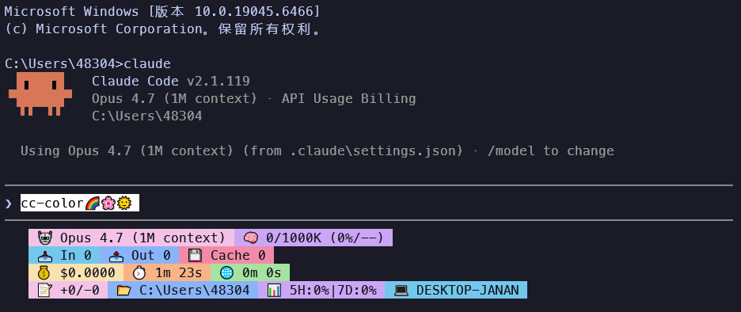

# color-cc

> ✨ A minimal, elegant dashboard for Claude Code terminal

[](https://opensource.org/licenses/MIT)
[]()

## 📸 Preview

<!-- Add your screenshot here -->


## ✨ Features

- 🎨 **4-Line Dashboard** - Model, Tokens, Cost, Git at a glance
- 🚀 **One-Command Install** - Up and running in seconds
- 🔄 **Auto-Persist** - Settings survive cc-switch account switches
- 🎯 **Real-time Metrics** - Live token usage and cost tracking
- 🌈 **Cosmic Theme** - Beautiful pastel colors inspired by Catppuccin

## 📦 Quick Start

### One-Line Installation

**Windows (PowerShell)**
```powershell
irm https://raw.githubusercontent.com/JananZZZ/color-cc/main/install.ps1 | iex
```

**Linux / macOS**
```bash
curl -fsSL https://raw.githubusercontent.com/JananZZZ/color-cc/main/install.sh | bash
```

### Restart Claude Code

That's it! 🎉 Restart Claude Code to see your new dashboard.

## 📖 What You'll See

| Line | Content |
|------|---------|
| **1** | 🤖 Model & 🧠 Token usage (current/total, % used, % remaining) |
| **2** | 📥 Input / 📤 Output / 💾 Cache tokens |
| **3** | 💰 Cost / ⏱️ Session duration / 🌐 API time |
| **4** | 📝 Code changes / 📂 Project / 🌿 Git / 💻 PC / 📊 Usage rate |

## ⚙️ Configuration

Want to customize? Edit `~/.claude/claude-dashboard.omp.json`

**Color Palette:**
```json
{
  "cosmic_pink": "#F5C2E7",
  "cosmic_purple": "#CBA6F7",
  "cosmic_blue": "#89B4FA",
  "cosmic_cyan": "#74C7EC",
  "cosmic_green": "#A6E3A1",
  "cosmic_yellow": "#F9E2AF",
  "cosmic_orange": "#FAB387",
  "cosmic_red": "#F38BA8"
}
```

[Configuration Guide →](docs/config.md)

## 🛠️ Requirements

- Claude Code installed
- Oh My Posh (auto-installed by the script)
- Windows PowerShell 5.1+ or bash 4.0+

## 🔧 Troubleshooting

Dashboard not showing? Check the [troubleshooting guide](docs/troubleshooting.md).

## 🤝 Contributing

Contributions welcome! Read [CONTRIBUTING.md](CONTRIBUTING.md)

## 📄 License

[MIT License](LICENSE) © 2025

---

## Contributors

Made with ❤️ by the community and all [contributors](https://github.com/JananZZZ/color-cc/graphs/contributors)
